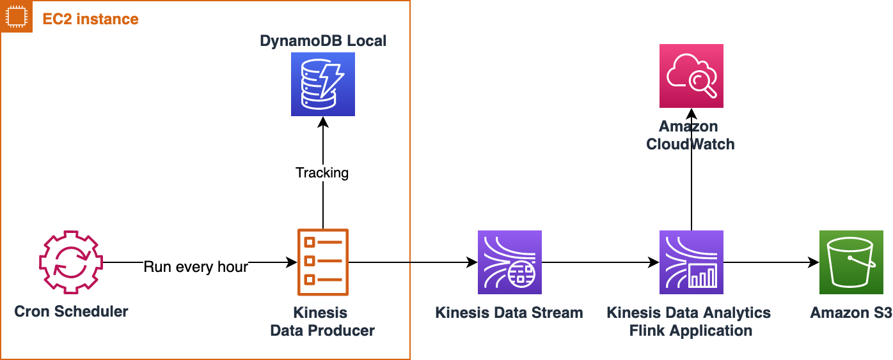
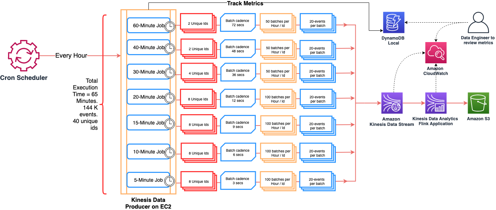

# Amazon Managed Service for Apache Flink (formerly Amazon Kinesis Data Analytics) – Benchmarking Utility

--------

>  #### 🚨 August 30, 2023: Amazon Kinesis Data Analytics has been renamed to [Amazon Managed Service for Apache Flink](https://aws.amazon.com/managed-service-apache-flink).

--------

Amazon Kinesis Data Analytics Flink Benchmarking Utility helps with capacity planning, integration testing, and benchmarking of [Kinesis Data Analytics for Apache Flink](https://docs.aws.amazon.com/kinesisanalytics/latest/java/what-is.html) applications. Using this utility, you can generate sample data and write it to one or more Kinesis Data Streams based on the requirements of your Flink applications. This utility is used in conjunction with a Flink Application with Kinesis Data Stream as a source and one of the supported [Sinks](https://docs.aws.amazon.com/kinesisanalytics/latest/java/how-sinks.html) for e.g. Amazon S3.

Capacity planning, integration testing, and benchmarking of Flink applications generally involves a lot of work. This utility will provide you a solution where you can define data format, generate and write sample data to a Kinesis Data Stream. Using this Kinesis Data Stream as a source, you will create a Kinesis Data Analytics Flink application and perform necessary testing. The format used and the data generated are compatible with Flink application's business logic. You will define benchmarking specifications based on your capacity or load testing requirements.

This utility along with [Amazon Kinesis Data Analytics Flink Starter Kit](https://github.com/aws-samples/amazon-kinesis-data-analytics-flink-starter-kit) will provide you a complete example.

**Contents:**

* [Architecture](#architecture)
* [Detailed Architecture](#detailed-architecture)
* [Application Overview](#application-overview)
* [Build Instructions](#build-instructions)
* [Deployment Instructions](#deployment-instructions)
* [Appendix](#appendix)

- - -

## Architecture

The below diagram represents the architecture of this utility.



- - -

## Detailed Architecture

The diagram below represents the detailed architecture.



In the diagram, each time the Kinesis data producer job is invoked, it runs one or more child child jobs based on the specifications provided in a JSON file. Each child job has the below characteristics:

 1. Generate sample records and write them to a Kinesis Data Streams. These records will be consumed by a Flink application
 1. Records are generated based on a pre-defined record format
 1. Records are randomized based on a number of unique identifiers
 1. Records generated as batches which has a configurable size
 1. Batches are written to Kinesis Stream with a configurable cadence in seconds
 1. Each child job terminates gracefully once it complete writing data to Kinesis Stream

[Benchmarking Specifications](#benchmarking-specifications) section explains this process in detail.

- - -

## Application Overview

### Pre-requisites

 1. JDK 8
 1. IDE for  e.g. [Eclipse](https://www.eclipse.org/) or [Spring Tools](https://spring.io/tools) or [Intellij IDEA](https://www.jetbrains.com/idea/)
 1. [Apache Maven](https://maven.apache.org/)
 1. [AWS CLI](https://docs.aws.amazon.com/cli/latest/userguide/install-cliv2.html)

- - -

### AWS Service Requirements

The following AWS services are required for this utility:

 1. 1 [Amazon EC2](https://aws.amazon.com/ec2/) Instance
 1. [DynamoDB Local](https://docs.aws.amazon.com/amazondynamodb/latest/developerguide/DynamoDBLocal.html)
 1. 1 [Amazon Kinesis Data Stream](https://aws.amazon.com/kinesis/data-streams/)
 1. 1 IAM role for EC2 instance
 1. 1 EC2 key pair to log onto EC2

- - -

### Benchmarking Specifications

This utility requires you to pass benchmarking specifications in other words load testing requirements in a JSON file based on a format defined in the sample [benchmarking_specs.json](./src/main/resources/benchmarking_specs.json).

#### Schema Definition

The below Table will help you define the specifications:

| Property | Type | Purpose |
|--------- | -----| --------|
| ```jobName``` | String  | The name of the Benchmarking Job |
| ```jobDurationInMinutes``` | String  | The duration of the job e.g. 65 minutes |
| ```region``` | String | The AWS region where the target Kinesis Stream(s) exist |
| ```targetKinesisStreams``` | Array | Names of target Kinesis Streams. This utility writes sample data to one or more configured streams. |
| ```isUsingDynamoDBLocal``` | boolean | When DynamoDB Local is used for status tracking this attribute is set to ```true```. When it is set to ```false```, it will use Amazon DynamoDB web service. |
| ```dynamoDBLocalURI``` | String | The URI for DynamoDB Local |
| ```parentJobSummaryDDBTableName``` | String | The name of the DynamoDB Table for Parent Job Summary |
| ```childJobSummaryDDBTableName``` | String | The name of the DynamoDB Table for Child Job Summary |
| ```childJobs``` | Array |  The list of Child Jobs to run part of the utility|

- - -

#### Schema Definition for childJobs

| Property | Type | Purpose |
|--------- | -----| --------|
| ```jobName``` | String | The name of child job|
| ```numberofInteractions``` | Integer | Number of unique session ids |
| ```batchSize``` | Integer | The size of  the batch |
| ```batchCadence``` | Integer | The batch frequency in seconds |
| ```numberofBatches``` | Integer | Number of  batches |

- - -

### Class Overview

| Class                                                         | Purpose |
|-------------------------------------------------------------- | --------|
| [BenchmarkScheduler](./src/main/java/com/amazonaws/kda/flink/benchmarking/BenchmarkScheduler.java) | Entry point and is the heart of the benchmarking utility. Its main main algorithm was developed based on open-source [Quartz Job Scheduling Library](http://www.quartz-scheduler.org/overview/). It schedules one more more Kinesis Producer jobs based on the benchmarking specifications.|
| [KinesisProducerForFlinkSessionWindow](./src/main/java/com/amazonaws/kda/flink/benchmarking//KinesisProducerForFlinkSessionWindow.java) | The class has the business logic to write sample records to Kinesis Stream. The sample records are compatible with a Flink Application implements [Session Window](https://ci.apache.org/projects/flink/flink-docs-stable/dev/stream/operators/windows.html#session-windows). This class also has the logic to track its own progress in DynamoDB tables. This class implements [Job Interface](http://www.quartz-scheduler.org/documentation/quartz-2.1.7/tutorials/tutorial-lesson-03.html) from **Quartz Scheduler**. |
| [KDSProducerUtil](./src/main/java/com/amazonaws/kda/flink/benchmarking/util/KDSProducerUtil.java) | Utility class with methods used by **KinesisProducerForFlinkSessionWindow** class.|
| [KinesisStreamUtil](./src/main/java/com/amazonaws/kda/flink/benchmarking/util/KinesisStreamUtil.java) | Utility class with business logic to work with Kinesis Data Stream.|
| [DDBUtil](./src/main/java/com/amazonaws/kda/flink/benchmarking/util/DDBUtil.java) | Utility class with business logic to write / update items (records) to DynamoDB tables.|

- - -

## Build Instructions

1. Clone this starter kit to your Laptop / MacBook
1. It has Maven nature, so you can import it to your IDE.
1. Build the Jar file using one of the steps below:
    1. Using standalone Maven, go to project home directory and run command ```mvn -X clean install```
    1. From Eclipse or STS, run command ```-X clean install```. Navigation: Project right click --> Run As --> Maven Build (Option 4)
1. Build process will generate a jar file  ```amazon-kinesis-data-analytics-flink-benchmarking-utility-0.1.jar```. Note: The  size  of the jar file is around 20 MB

- - -

## Deployment Instructions

### EC2 Instance Provisioning and Configuration

1. Create an IAM role for EC2 instance. It needs to have two policies as below
    1. Policy with write permissions for one or more Kinesis Stream configured as targets for this utility
    1. Policy with write permissions for DynamoDB tables used by this utility
    1. **Note:** For more details, on this topic, refer Amazon EC2 documentation [here](https://docs.aws.amazon.com/AWSEC2/latest/UserGuide/iam-roles-for-amazon-ec2.html).
1. Launch an EC2 instance with the IAM role
1. Take the Private IP address of your EC2
1. Log on to EC2 instance using command

    ```ssh -i my_ec2_keypair.pem ec2-user@IP_Address```

1. Run ```sudo yum update -y```
1. Install **OpenJDK** 8 using command

   ```sudo yum -y install java-1.8.0-openjdk.x86_64```

1. Check the Java version using the command ```java -version```.
    Sample output:

    ```bash
    openjdk version "1.8.0_252"
    OpenJDK Runtime Environment (build 1.8.0_252-b09)
    OpenJDK 64-Bit Server VM (build 25.252-b09, mixed mode)
    ```

1. Create a folder for Data Generator Application Binary. Use the command

    ```mkdir kda-flink-benchmarking-utility```

1. Create a folder for DynamoDB Locals. Use the command

    ```mkdir dynamodb_local```

1. Go to folder **kda-flink-benchmarking-utility** and create a folder for Logging. Use the command

    ```mkdir logs```

- - -

### Install DynamoDB Local

1. Go to DynamoDB Local folder

    ```cd dynamodb_local/```

1. Download DynamoDB Local Binary

    ```bash
    curl https://s3.us-west-2.amazonaws.com/dynamodb-local/dynamodb_local_latest.zip --output dynamodb_local_latest.zip
    ```

1. Unzip the file

    ```unzip dynamodb_local_latest.zip```

1. Start the DynamoDB Local

    ```nohup java -jar DynamoDBLocal.jar -sharedDb &```

1. Check the status of DynamoDB Local in the nohup.out as follows:

    ```bash
    [ec2-user@ip-X-X-X-X ~]$ cat nohup.out
    Initializing DynamoDB Local with the following configuration:
    Port:  8000
    InMemory:   false
    DbPath:  null
    SharedDb:   true
    shouldDelayTransientStatuses:   false
    CorsParams: *
    ```

1. At any time, check the status of DynamoDB Local using command ```ps -ef```

    ```bash
    ec2-user 13995     1  0 Sep09 ?        00:12:54 java -jar DynamoDBLocal.jar -sharedDb
    ```

- - -

### Configure the Kinesis Data Generator App 

1. Come back to your MacBook or Laptop
1. In ```src/main/resources/benchmarking_specs.json``` update the ```targetKinesisStreams``` array to the kinesis stream(s) that you want data written to and ```region``` to the region the stream(s) exist in
1. In ```src/main/resources/create_table_kinesis_stream.json``` update ```TableName``` to match the kinesis stream you want data written to
1. If you have more than 1 stream to write to then duplicate ```src/main/resources/create_table_kinesis_stream.json``` for each stream changing  ```TableName``` in each file accordingly.

- - -

### Deploy Kinesis Data Generator App

1. Copy Kinesis Data Generator binaries to the EC2 instance. **Note:** Steps below are relevant for SCP (secure copy) tool on MacBook.

   1. Copy the jar file to EC2 instance

        ```bash
        scp -i my_ec2_keypair.pem <path_to_your_ide_workspace>/Amazon-kda-flink-benchmarking-utility/target/amazon-kinesis-data-analytics-flink-benchmarking-utility-0.1.jar ec2-user@IP_Address:/home/ec2-user/kda-flink-benchmarking-utility/
        ```

   1. Copy benchmarking specifications JSON to EC2 instance

        ```bash
        scp -i my_ec2_keypair.pem <path_to_your_ide_workspace>/Amazon-kda-flink-benchmarking-utility/src/main/resources/benchmarking_specs.json ec2-user@IP_Address:/home/ec2-user/kda-flink-benchmarking-utility/
        ```

   1. Copy DynamoDB Table JSON files to EC2 instance

        ```bash
        scp -i my_ec2_keypair.pem <path_to_your_ide_workspace>/Amazon-kda-flink-benchmarking-utility/src/main/resources/create_table_child_job_summary.json ec2-user@IP_Address:/home/ec2-user/kda-flink-benchmarking-utility/
        ```

       ```bash
        scp -i my_ec2_keypair.pem <path_to_your_ide_workspace>/Amazon-kda-flink-benchmarking-utility/src/main/resources/create_table_parent_job_summary.json ec2-user@IP_Address:/home/ec2-user/kda-flink-benchmarking-utility/
        ```

    1. Copy DynamoDB Table JSON files for Kinesis Streams to EC2 instance
        ```bash
        scp -i my_ec2_keypair.pem <path_to_your_ide_workspace>/Amazon-kda-flink-benchmarking-utility/src/main/resources/create_table_kinesis_stream.json ec2-user@IP_Address:/home/ec2-user/kda-flink-benchmarking-utility/
        ```
        (Repeat for all duplicates created if you're  writing to multiple streams)

   1. Copy the Bash script to EC2 instance

        ```bash
        scp -i my_ec2_keypair.pem <path_to_your_ide_workspace>/Amazon-kda-flink-benchmarking-utility/src/main/resources/amazon-kda-flink-benchmarking-utility.sh ec2-user@IP_Address:/home/ec2-user/kda-flink-benchmarking-utility/
        ```

   1. **Note:** To use PuTTY, refer [Connecting to Your Linux Instance from Windows Using PuTTY](https://docs.aws.amazon.com/AWSEC2/latest/UserGuide/putty.html)

- - -

### Create Tables in DynamoDB Local

1. From the EC2 instance and while in folder **kda-flink-benchmarking-utility**, run the below command to create DynamoDB tables

    ```bash
    aws dynamodb create-table \
    --cli-input-json file://create_table_parent_job_summary.json \
    --region us-east-1 \
    --endpoint-url http://localhost:8000
    ```

    ```bash
    aws dynamodb create-table \
    --cli-input-json file://create_table_child_job_summary.json \
    --region us-east-1 \
    --endpoint-url http://localhost:8000
    ```

    ```bash
    aws dynamodb create-table \
    --cli-input-json file://create_table_kinesis_stream.json \
    --region us-east-1 \
    --endpoint-url http://localhost:8000
    ```
    (Repeat for all files if you're writing to multiple streams)

1. Check the tables by running the below command

    ```bash
    aws dynamodb list-tables --region us-east-1 --endpoint-url http://localhost:8000
    ```

1. Expected output

    ```json
    {
    "TableNames": [
        "kda_flink_benchmarking_child_job_summary",
        "kda_flink_benchmarking_parent_job_summary",
        "<kinesis-stream(s)>"
        ]
    }
    ```

- - -

### Setup Cron Scheduler

1. Check the status of Cron on EC2 instance using command ```service crond status```. You will get an output something like below.

    ```bash
    Redirecting to /bin/systemctl status crond.service
    ● crond.service - Command Scheduler
    Loaded: loaded (/usr/lib/systemd/system/crond.service; enabled; vendor preset: enabled)
    Active: active (running) since Mon 2020-09-07 09:50:49 UTC; 3 days ago
   ```

1. Open the crontab using the command

    ```crontab -e```

1. Enter the following line

    ```30 * * * * /bin/bash /home/ec2-user/kda-flink-benchmarking-utility/amazon-kda-flink-benchmarking-utility.sh```
    This will run the data-generator as a cron-job every hour at 30 minutes past the hour.
    Once the job starts for the first time you should see incoming data on your kinesis stream(s)

- - -

## Appendix

### Using DynamoDB web service instead of DynamoDB Local

Using DynamoDB web service instead of DynamoDB Local is easy. Follow the below instructions:

 1. In [benchmarking_specs.json](./src/main/resources/benchmarking_specs.json), set ```"isUsingDynamoDBLocal":``` to ```false``` and you can leave the default value for attribute ```"dynamoDBLocalURI:"``` as is or set it to ```"None"```.
 1. Run the below command to create tables in Amazon DynamoDB web service:

    ```bash
    aws dynamodb create-table \
    --cli-input-json file://create_table_kinesis_stream.json \
    --region us-east-1
    ```

    ```bash
    aws dynamodb create-table \
    --cli-input-json file://create_table_parent_job_summary.json \
    --region us-east-1
    ```

    ```bash
    aws dynamodb create-table \
    --cli-input-json file://create_table_child_job_summary.json \
    --region us-east-1
    ```

### Future Releases

1. Support Amazon ECS to host the solution
1. Support additional scheduling methods
1. Generate test data suitable for [Tumbling Windows](https://ci.apache.org/projects/flink/flink-docs-stable/dev/stream/operators/windows.html#tumbling-windows) and [Sliding Windows](https://ci.apache.org/projects/flink/flink-docs-stable/dev/stream/operators/windows.html#sliding-windows)
1. Ability to generate test data with timestamp information. This will be useful for Flink Applications configured to use Event Time or Processing Time. For more details, refer Apache Flink [documentation](https://ci.apache.org/projects/flink/flink-docs-release-1.8/dev/event_time.html).

- - -

## License Summary

This sample code is made available under the MIT-0 license. See the LICENSE file.